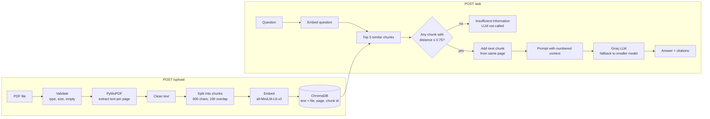

# AI Document Intelligence System

Upload PDF documents and ask questions about them. Answers come only from the documents, with citations (file + page). If the answer isn't in the documents, the system says so instead of guessing.

**Stack:** FastAPI · PyMuPDF · ChromaDB · all-MiniLM-L6-v2 embeddings · Groq (`openai/gpt-oss-120b`)

## Architecture



### Project structure

```
app/
  config.py         settings from environment variables
  pdf_processor.py  extract, clean and chunk PDF text
  vector_store.py   ChromaDB: store chunks and search
  llm.py            prompt + Groq call (with fallback model)
  rag.py            retrieve -> filter -> add next chunk -> generate -> citations
  main.py           FastAPI endpoints
streamlit_app.py    simple web UI (same pipeline, no HTTP)
eval/
  questions.json    15 evaluation questions
  run_eval.py       runs them and writes results.csv
  results.md        results and discussion
tests/              API and unit tests
data/               sample PDFs used for the evaluation (NIST, public domain)
```

## Setup

```bash
git clone <repo-url> && cd doc-qa-rag
python -m venv .venv && source .venv/bin/activate
pip install -r requirements.txt
cp .env.example .env        # then add your GROQ_API_KEY
uvicorn app.main:app --reload
```

Open http://localhost:8000/docs for the Swagger UI.

The embedding model (~80 MB) is downloaded automatically the first time.

**Docker:**
```bash
docker build -t doc-qa .
docker run -p 8000:8000 --env-file .env doc-qa
```

### Environment variables

| Variable | Default | Description |
|---|---|---|
| `GROQ_API_KEY` | — | **Required.** Groq API key |
| `LLM_MODEL` | `openai/gpt-oss-120b` | Main model |
| `FALLBACK_MODEL` | `openai/gpt-oss-20b` | Used if the main model fails |
| `CHROMA_DIR` | `chroma_db` | Where the vector DB is saved |
| `CHUNK_SIZE` | `600` | Chunk size in characters |
| `CHUNK_OVERLAP` | `100` | Overlap between chunks |
| `TOP_K` | `5` | Number of chunks retrieved |
| `MAX_DISTANCE` | `0.75` | Chunks less similar than this are ignored |
| `MAX_FILE_MB` | `20` | Upload size limit |

## Web UI

A simple Streamlit page to upload PDFs and ask questions.

```bash
streamlit run streamlit_app.py
```

## API

### `POST /upload`
Upload a PDF (multipart form, field name `file`).

```bash
curl -F "file=@data/NIST.AI.100-1.pdf" http://localhost:8000/upload
curl -F "file=@data/NIST.AI.600-1.pdf" http://localhost:8000/upload
```
```json
{"file_name": "NIST.AI.100-1.pdf", "pages_with_text": 48, "chunks": 277}
```

| Status | When |
|---|---|
| 400 | not a `.pdf`, empty file, or corrupted PDF |
| 413 | file too large |
| 422 | no text found (e.g. scanned PDF) |
| 503 | vector DB error |

Uploading the same file again replaces its chunks (no duplicates).

### `POST /ask`

```bash
curl -X POST http://localhost:8000/ask \
  -H "Content-Type: application/json" \
  -d '{"question": "What is confabulation?"}'
```
```json
{
  "answer": "Confabulation is the phenomenon in which generative-AI systems produce and confidently present erroneous or false content, often called \"hallucinations\" ... [1][4]",
  "citations": [
    {"ref": 1, "file_name": "NIST.AI.600-1.pdf", "page": 10,
     "chunk_id": "NIST.AI.600-1.pdf-p10-c0", "distance": 0.277, "text": "2.2. Confabulation ..."},
    {"ref": 4, "file_name": "NIST.AI.600-1.pdf", "page": 8,
     "chunk_id": "NIST.AI.600-1.pdf-p8-c0", "distance": 0.718, "text": "1. CBRN Information or Capabilities ..."}
  ],
  "answered": true
}
```
When the answer is not in the documents:
```json
{"answer": "Insufficient information in the provided documents to answer this question.", "citations": [], "answered": false}
```

| Status | When |
|---|---|
| 400 | empty question, or no documents uploaded yet |
| 503 | Groq API key missing, or both models failed |
| 500 | unexpected error (logged) |

### `GET /health`
```json
{"status": "ok", "vector_db": "ok", "groq_api_key_set": true, "llm_model": "openai/gpt-oss-120b", "chunks_indexed": 678}
```
`status` is `degraded` if the vector DB is down or the API key is missing.

## Design decisions

### PDF processing
PyMuPDF is fast and gives text page by page, so every chunk keeps its page number. Cleaning is kept minimal: remove lines that are only page numbers, re-join words hyphenated across lines, and collapse extra whitespace. I chunk each page separately so every chunk maps to exactly one page for citations.

### Chunking — 600 characters, 100 overlap
- The embedding model only reads the first 256 tokens (~1000 characters), so chunks must stay below that or the end is silently ignored.
- I compared 400/600/800/1000 on the evaluation questions (table in [eval/results.md](eval/results.md)). 400–800 performed about the same and 1000 was worse. Smaller chunks keep one topic per chunk, so the embedding is not a "blend" of several topics.
- The splitter cuts at a paragraph, then sentence, then line, then word boundary, so chunks don't stop mid-word.
- 100 characters of overlap (about 1-2 sentences) means a fact sitting on a chunk border appears whole in at least one chunk.

### Embeddings — all-MiniLM-L6-v2
- Runs locally (ONNX, CPU) through ChromaDB's default embedding function: no extra API key, no cost, no network call per chunk.
- Small and fast (384 dimensions) with good quality for semantic search in English.
- Trade-off: it is a small model. Both retrieval misses in the evaluation are on this model (e.g. it doesn't link "law" in a question with "Act" in the text). A larger model such as `bge-base` would likely do better, at the cost of speed and a heavier install.

### Vector store — ChromaDB
Stores embeddings, text and metadata together, supports cosine distance and saves to disk. Nothing to deploy and anyone can run the project after cloning. For production I would move to Qdrant or Pinecone (see below).

### Retrieval — top-k 5 + distance threshold
- k=5 gave the best recall vs. context size trade-off in my test (k=3 found 8/12, k=5 10/12, k=8 11/12 but with a much bigger prompt).
- **Next-chunk expansion:** for every retrieved chunk, the next chunk from the same page is added to the context. Lists and definitions are often cut at a chunk border (the start is retrieved, the rest isn't). This was the single biggest improvement in the evaluation (see results).
- **Threshold (cosine distance ≤ 0.75):** if no chunk passes, the system answers "insufficient information" **without calling the LLM** — it can't hallucinate, and it saves a call. On the evaluation set, the best chunk for answerable questions was between 0.19 and 0.44, and for a fully off-topic question ("Who won the 2022 FIFA World Cup?") 0.85, so 0.75 sits between them with some margin for harder questions.
- The threshold only catches off-topic questions. Questions that *sound* related but aren't answered in the document ("What is the annual budget of the U.S. AI Safety Institute?" — 0.39, the institute is mentioned but not its budget) pass the threshold, so for those the prompt rule is what makes the model abstain. That's why both layers are needed.

### LLM and prompt
- Groq with `openai/gpt-oss-120b`: fast, cheap, good at following instructions. `temperature=0` for consistent answers.
- The prompt tells the model to use only the numbered context, cite each fact as `[n]`, and reply with an exact "insufficient information" sentence if the answer isn't there. Using an exact sentence makes it easy to detect in code.
- Only the chunks the model actually cited are returned as citations.
- Two layers against hallucination: the distance threshold (before the LLM) and the prompt rule (inside the LLM).
- If the main model fails (outage, rate limit, timeout), the request is retried with a smaller fallback model.

### Logging
Every upload (pages, chunk count), retrieval (distances of the retrieved chunks), LLM call (model, latency, tokens) and error is logged with a timestamp.

## Evaluation

15 questions over two public-domain NIST documents in `data/` — the AI Risk Management Framework (NIST AI 100-1) and the Generative AI Profile (NIST AI 600-1): 12 answerable (6 per document, including definitions, lists and dates) and 3 unanswerable (one of them about something the documents mention but don't answer).

| Metric | Result |
|---|---|
| Answer accuracy (automatic keyword check) | 13 / 15 |
| **Answer accuracy (after reading every answer)** | **12 / 15** |
| Retrieval hit rate (right page in top 5) | 10 / 12 |
| Correct abstentions on unanswerable questions | 3 / 3 |

The 3 failures: two retrieval misses (the small embedding model didn't find the right chunk; hybrid search fixes one of them in my test) and one answer where the model added an extra wrong item to a list.

Full table, failure analysis and improvements: [eval/results.md](eval/results.md). Run it with:
```bash
python -m eval.run_eval
```

## Tests

```bash
pytest -q
```
They cover upload validation (wrong type, empty, fake PDF, PDF without text), empty questions, citation parsing, the "no LLM call when nothing is relevant" rule, and the text splitter.

## Limitations

- **No OCR:** scanned PDFs are rejected with a 422 error.
- **Tables and dense lists** are extracted as plain text and can lose their structure (the model mixed up two adjacent lists in one evaluation question).
- **Retrieval uses vectors only.** Exact names and terms are sometimes missed; hybrid search (BM25 + vectors) is the next step.
- **Chunks never cross page boundaries,** so a paragraph continuing on the next page is split.
- **No conversation history:** every question is independent.
- **Single collection:** all uploaded documents are searched together; there is no per-user separation and no delete endpoint.
- The distance threshold was tuned on one document; it may need adjusting for very different documents.
- Upload runs synchronously, so a very large PDF blocks that request while it is embedded. Chunks are written to Chroma in batches of 500, so large documents don't hit Chroma's batch limit, and only the top chunks are ever sent to the LLM, so document size doesn't affect prompt size.

## Scaling and production ideas

- **1,000 concurrent users:** run several Uvicorn workers behind a load balancer; move to a hosted vector DB (Qdrant/Pinecone) shared by all instances; process uploads in a background queue (Celery/RQ) instead of in the request.
- **Cost:** embeddings are already local and free; cache answers for repeated questions; send fewer, better chunks (reranker); use the smaller model for simple questions.
- **Better retrieval:** hybrid search (BM25 + vectors) for exact terms like numbers and names, a cross-encoder reranker, and adding neighbouring chunks for context.
- **Monitoring:** track latency, token usage, error rate and the "insufficient information" rate; tracing with Langfuse or LangSmith.
