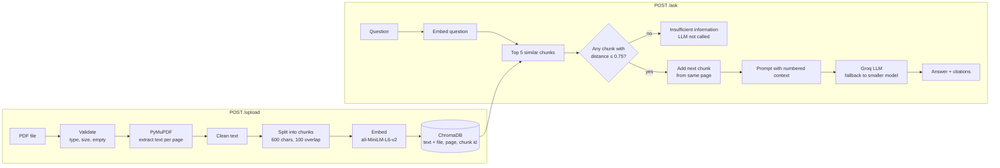

# AI Document Intelligence System

Upload PDF documents and ask questions about them. Answers come only from the documents, with citations (file + page). If the answer isn't in the documents, the system says so instead of guessing.

**Stack:** FastAPI · PyMuPDF · ChromaDB · all-MiniLM-L6-v2 embeddings · Groq (`openai/gpt-oss-120b`)

## Architecture



### Project structure

```
app/
  config.py         settings from environment variables
  pdf_processor.py  extract, clean and chunk PDF text
  vector_store.py   ChromaDB: store chunks and search
  llm.py            prompt + Groq call (with fallback model)
  rag.py            retrieve -> filter -> add next chunk -> generate -> citations
  main.py           FastAPI endpoints
streamlit_app.py    simple web UI (same pipeline, no HTTP)
eval/
  questions.json    15 evaluation questions
  run_eval.py       runs them and writes results.csv
  results.md        results and discussion
tests/              API and unit tests
data/               sample PDFs used for the evaluation (NIST, public domain)
```

## Setup

```bash
git clone <repo-url> && cd doc-qa-rag
python -m venv .venv && source .venv/bin/activate
pip install -r requirements.txt
cp .env.example .env        # then add your GROQ_API_KEY
uvicorn app.main:app --reload
```

Open http://localhost:8000/docs for the Swagger UI.

The embedding model (~80 MB) is downloaded automatically the first time.

**Docker:**
```bash
docker build -t doc-qa .
docker run -p 8000:8000 --env-file .env doc-qa
```

### Environment variables

| Variable | Default | Description |
|---|---|---|
| `GROQ_API_KEY` | — | **Required.** Groq API key |
| `LLM_MODEL` | `openai/gpt-oss-120b` | Main model |
| `FALLBACK_MODEL` | `openai/gpt-oss-20b` | Used if the main model fails |
| `CHROMA_DIR` | `chroma_db` | Where the vector DB is saved |
| `CHUNK_SIZE` | `600` | Chunk size in characters |
| `CHUNK_OVERLAP` | `100` | Overlap between chunks |
| `TOP_K` | `5` | Number of chunks retrieved |
| `MAX_DISTANCE` | `0.75` | Chunks less similar than this are ignored |
| `MAX_FILE_MB` | `20` | Upload size limit |

## Web UI

A simple Streamlit page to upload PDFs and ask questions.

```bash
streamlit run streamlit_app.py
```

## API

### `POST /upload`
Upload a PDF (multipart form, field name `file`).

```bash
curl -F "file=@data/NIST.AI.100-1.pdf" http://localhost:8000/upload
curl -F "file=@data/NIST.AI.600-1.pdf" http://localhost:8000/upload
```
```json
{"file_name": "NIST.AI.100-1.pdf", "pages_with_text": 48, "chunks": 277}
```

| Status | When |
|---|---|
| 400 | not a `.pdf`, empty file, or corrupted PDF |
| 413 | file too large |
| 422 | no text found (e.g. scanned PDF) |
| 503 | vector DB error |

Uploading the same file again replaces its chunks (no duplicates).

### `POST /ask`

```bash
curl -X POST http://localhost:8000/ask \
  -H "Content-Type: application/json" \
  -d '{"question": "What are the four functions of the AI RMF Core?"}'
```
Returns the answer and the sources it used (file name and page for each citation):
```json
{
  "answer": "The AI RMF Core has four functions: GOVERN, MAP, MEASURE and MANAGE [1].",
  "citations": [{"file_name": "NIST.AI.100-1.pdf", "page": 25}],
  "answered": true
}
```
If the answer is not in the documents, `answer` is "Insufficient information..." and `answered` is `false`.

| Status | When |
|---|---|
| 400 | empty question, or no documents uploaded yet |
| 503 | Groq API key missing, LLM unavailable, or vector DB error |
| 500 | unexpected error (logged) |

### `GET /health`
```json
{"status": "ok", "vector_db": "ok", "groq_api_key_set": true, "llm_model": "openai/gpt-oss-120b", "chunks_indexed": 678}
```
`status` is `degraded` if the vector DB is down or the API key is missing.

## Design decisions

### PDF processing
- **PyMuPDF** reads the text page by page, so every chunk knows which page it came from.
- Cleaning is kept light: fix special characters (like the "fi" ligature), remove page-number lines, re-join hyphenated words and remove extra spaces.
- Each page is chunked separately, so every citation points to exactly one page.

### Chunking — 600 characters, 100 overlap
- The embedding model only reads about 1000 characters, so chunks must be smaller than that.
- I tested 400, 600, 800 and 1000 characters (see [eval/results.md](eval/results.md)). 400–800 worked about the same, 1000 was worse.
- Smaller chunks usually hold one topic, which makes search more accurate.
- Chunks are cut at a paragraph, sentence or word boundary, never in the middle of a word.
- The 100-character overlap means a sentence on the border between two chunks is not lost.

### Embeddings — all-MiniLM-L6-v2
- Runs locally on CPU: free, fast, and no extra API key.
- Good quality for English semantic search.
- Downside: it's a small model. Both retrieval misses in the evaluation come from it (e.g. it doesn't match "law" in the question with "Act" in the text). A bigger model would do better.

### Vector store — ChromaDB
- Stores the text, embeddings and metadata (file, page, chunk ID) together.
- Saves to a local folder, so the project runs right after cloning — nothing else to install or host.
- For production I would use a hosted DB like Qdrant or Pinecone.

### Retrieval — top 5 chunks + similarity threshold
- **Top 5:** in my test, 3 chunks missed too much and 8 only helped slightly while doubling the prompt size.
- **Next chunk added:** for each retrieved chunk, the next chunk on the same page is also sent to the LLM. Lists and definitions are often cut between two chunks; this was the biggest improvement in the evaluation.
- **Threshold (distance ≤ 0.75):** if no chunk is similar enough, the system answers "insufficient information" without calling the LLM at all. Real questions scored 0.19–0.44; an off-topic one ("Who won the 2022 FIFA World Cup?") scored 0.85.

### LLM and prompt
- **Groq + `openai/gpt-oss-120b`:** fast, low cost and follows instructions well. Temperature is 0 for consistent answers.
- The prompt says: use only the given context, cite every fact as `[1]`, `[2]`..., and if the answer isn't there, reply with an exact "insufficient information" sentence.
- Only the chunks the model actually cited are returned as sources.
- **Two layers against hallucination:** the threshold stops off-topic questions, and the prompt rule handles questions that sound related but aren't answered in the documents (e.g. "What is the budget of the U.S. AI Safety Institute?" — the institute is mentioned, the budget isn't).
- **Fallback:** if the main model fails (outage, rate limit, timeout), the smaller `gpt-oss-20b` is tried automatically.

### Logging
Uploads (pages, chunks), retrieval (similarity scores), LLM calls (model, time, tokens) and all errors are logged with timestamps.

## Evaluation

15 questions on two public NIST documents in `data/` (AI Risk Management Framework and Generative AI Profile): 12 answerable and 3 that the documents can't answer.

| Metric | Result |
|---|---|
| Answer accuracy (automatic check) | 13 / 15 |
| **Answer accuracy (checked by hand)** | **12 / 15** |
| Right page found in top 5 | 10 / 12 |
| Unanswerable questions correctly refused | 3 / 3 |

The 3 failures:
- 2 retrieval misses — the embedding model didn't find the right chunk (hybrid search fixed one of them in my test).
- 1 answer where the model added a wrong extra item to a list.

Full results and analysis: [eval/results.md](eval/results.md). Run it with `python -m eval.run_eval`.

## Tests

```bash
pytest -q
```
Covers file validation (wrong type, empty, fake or text-less PDF), empty questions, citation parsing, the "no LLM call when nothing is relevant" rule, vector-DB failure handling and text cleaning/splitting.

## Limitations

- No OCR — scanned PDFs are rejected.
- Tables and dense lists lose their layout when extracted as plain text.
- Search is vector-only, so exact names and terms are sometimes missed.
- Chunks don't cross pages, so a paragraph continuing on the next page is split.
- No conversation history — each question is independent.
- All documents share one collection (no per-user separation), and the API has no delete endpoint.
- The threshold was tuned on two documents and may need adjusting for very different ones.
- Uploads are processed inside the request, so a very large PDF takes a while. (Large files are saved in batches, and only the top chunks go to the LLM, so size doesn't affect the prompt.)

## Scaling and production ideas

- **1,000 concurrent users:** several API workers behind a load balancer, a hosted vector DB shared by all of them, and uploads processed in a background queue.
- **Lower cost:** cache answers to repeated questions, send fewer but better chunks, and use the smaller model for simple questions.
- **Better retrieval:** hybrid search (keywords + vectors), a reranker, and rewriting the question before searching.
- **Monitoring:** track response time, token usage, errors and how often the system says "insufficient information".
